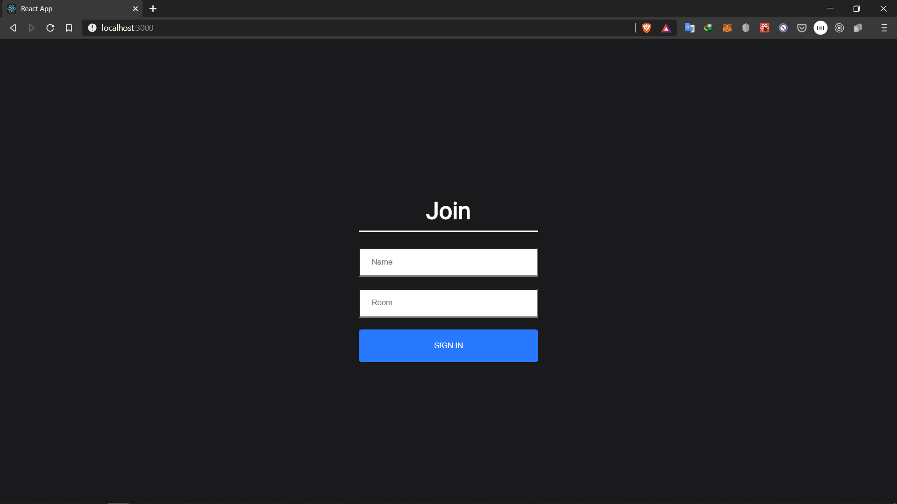
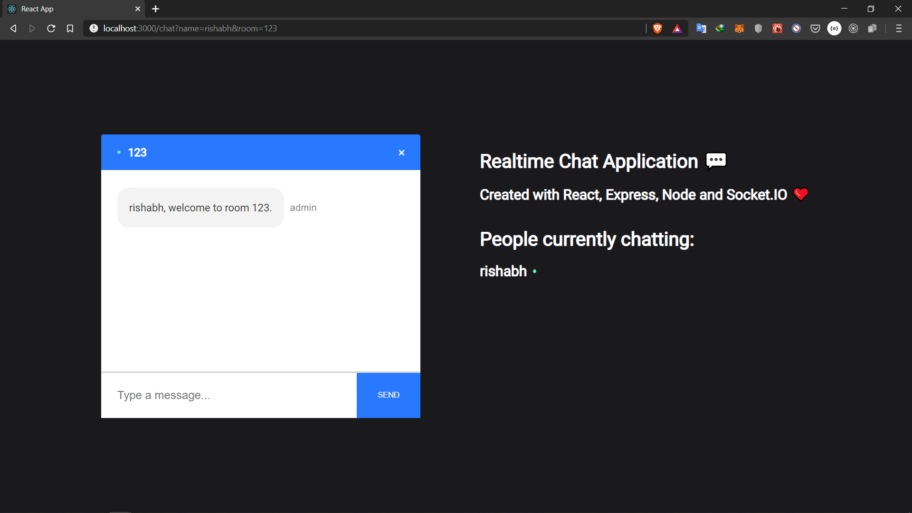
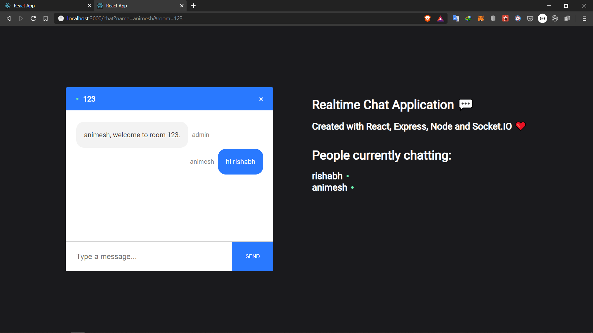
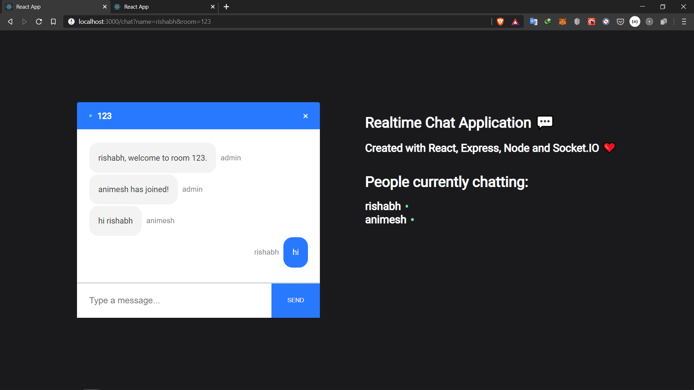

# __Real Time__ Chat Application

* User1 enters his name and the room he wants to join

* Automated greeting message from admin to the new user joined 

* Whenever a new user joins to the same room, message is broadcasted to every other user on the room that a new user has joined
* New user can't have a name already used in the room

* Messages are sent seamlessly with minimal delay using websockets 

* Whenever a user leaves the room or refreshes the page he/she is exited from the room and message is broadcasted to all users that a user has left the room
